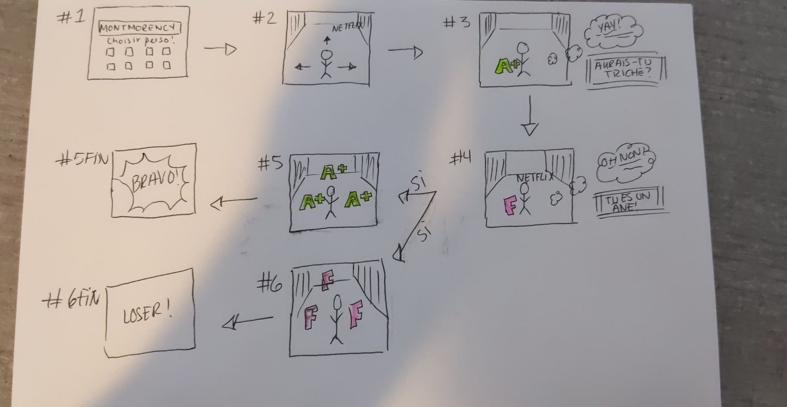
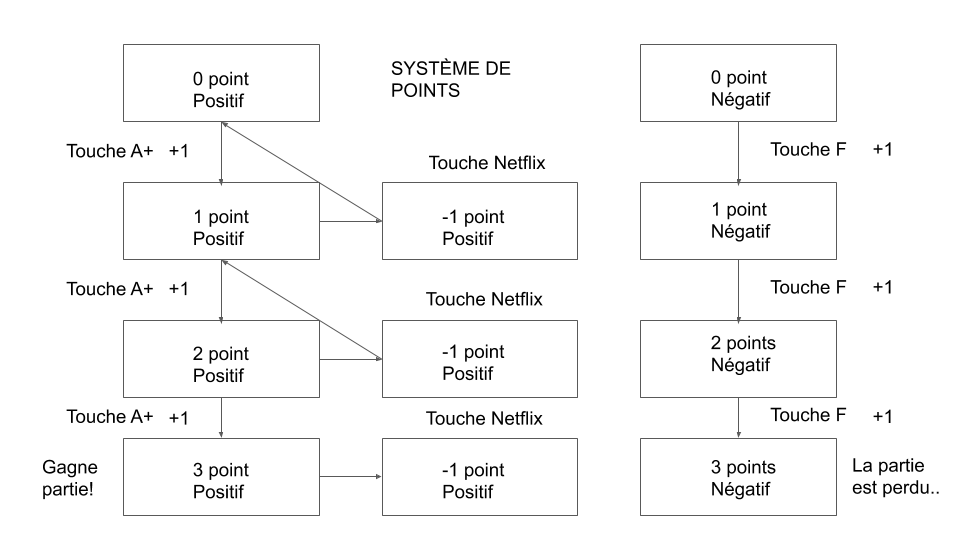

# Bilan 
## Membres de l’équipe : Pamela, Jan Carlos et David

Au départ, le projet n’avait aucun lien avec celui d’en ce moment. C’était une projection de particules interactivesen lien avec les mouvements des personnes présentes devant la kinect. Toutefois, nous n’étions pas du tout motivés à faire ce projet, alors qu’en ce moment, nous ne pouvons arrêter de trouver de nouvelles idées. Maintenant, notre projet est bien plus amusant et nous représente mieux. Voici un petit résumé :

*School run est petit jeu sur le thème des études. Il montre comment, en ce moment de pandémie, les études peuvent être très stressantes et démotivantes, en plus d’avoir un nombre de distractions manifestement plus élevé. Le jeu va comme suit : un personnage court vers l’avant dans un couloir scolaire. Plusieurs obstacles (distractions) sont dans son chemin et il doit les éviter. Dans son parcours, il y aura des A+ à attraper et des F à éviter. Après avoir touché trois de l’un d’eux, c’est la fin de la partie. Le message de fin changera selon s’il a eu trois A+ ou trois F. Si le joueur touche un obstacle (distraction), il perdra un A+. De plus, les évènements qui se produisent dans le jeu vont en partie être recréés dans un espace physique, afin de rendre l’expérience le plus immersive possible.*

Voici un petit croquis *TRÈS* bien dessiné de ce qui se passe.

Le tout peut se passer de deux façons. La première est exlusivement en ligne. En effet, le jeu sera mis sur un site Web dédié aux projets finaux de la cohorte 2018 de TIM. Si l’utilisateur le souhaite, il peut cliquer sur la page de notre projet et le tour est joué, il ne reste qu’à apprécier le jeu avec un clavier et une souris (nous voulons que les touches soient le plus instinctives possible. Donc pour sauter, ça sera la barre espace). Toutefois, il y a une deuxième façon, qui est bien meilleure. S’il le souhaite, l’utilisateur peut, pendant la semaine du 22 mars, venir au collège et en plus de jouer à *School Run*, il va le vivre. Oui, oui ! Des projecteurs, des haut-parleurs et des lumières iront chercher des éléments du jeu pour les amener dans la vie réelle. Tout ceci se passera dans une classe vide si possible, sinon nous adapterons le tout dans le grand studio. Si c’est dans une classe, les sons et les projections devront couvrir l’ensemble de la pièce pour que ça soit vraiment immersif. Par exemple, si le joueur touche un A+, la lumière dans la pièce deviendra verte pendant 2 secondes et rouge s’il touche un F. S’il entre en contact avec un logo de Netflix, les affiches de films et séries exploseront partout sur les murs de la classe. Les bruits associés se feront entendre dans les haut-parleurs.

Pour trouver les idées, les trois membres de l’équipe ont aidé à bien mettre sur papier les différentes possibilités. Par la suite, Pamela, pour le projet primitif de Réalité virtuelle, a fait un prototype de *School Run* afin de voir quelles étaient les méthodes à utiliser. Jan Carlos a alors pris ce code et l’a modifié pour le mettre plus a l’image de *School Run*. Pamela et Jan Carlos ont fait des recherches pour les particules, les sons et les personnages qui allaient être utilisés. David, pour sa part, a modélisé les obstacles et les bonus.

Pour nous assurer de bien avancer malgré notre retard, nous avons décidé de nous rencontrer deux fois par semaine (au moins) pour mettre à jour le Trello et pour voir notre avancement et nos nouvelles idées. Nous avons choisi Trello, car nous y sommes familiers. 

Il reste plusieurs choses à faire avant de dire que nous avons terminé

- Créer un menu de sélection de personnages 
- Ajouter des détails sur les bonus et les obstacles, comme des animations de haut en bas et des particules 
- Faire afficher les messages sur l’écran au lieu de dans la console 
- Créer les menus de début et de fin
- Rendre le décor moins répétitif
- Choisir les logiciels qu’on va utiliser pour l’expérience interactive 
- Faire les liens entre ces logiciels et Unity afin de contrôler le réel grâce au jeu 
- Faire un plan de la classe pour savoir comment tout placer les éléments. 

Pour l’instant, nous n’avons pas fait d’inventaire de médias, car nous ne sommes pas certains de garder le son que nous avons en ce moment. Il y a des chances que nous les créons nous-mêmes si nous avons le temps. Le reste de ce qu’on utilise est dans nos bibliothèques d’Assets sur Unity, comme nos particules, nos textures et nos personnages.

Nous allons avoir besoin de projecteurs, de haut-parleurs de lumières que nous allons installer au plafond pour bien englober la pièce. Nous allons également avoir besoin d’un ordinateur (les configurations minimum requises seront ultérieurement testées et mises ici) et d’une classe vide. Pour les logiciels, nous avons utilisé Unity (parce que c’est un jeu et que faire un jeu avec Unity, c’est bien) et de Maya pour modéliser les obstacles et les bonus. Nous aurons éventuellement besoin de peut-être MapMapper pour les projections visuelles et d’OSC pour les lumières. Le son venant directement d’Unity va être celui entendu par l’utilisateur.

Il va y avoir beaucoup de choses à bien coder pour assurer le bon fonctionnement du projet. Voici une liste de ce que nous allons devoir tester :

- Le jeu doit être jouable en ligne pour plusieurs personnes en même temps 
- Il doit y a voir un menu de sélection de personnages qui change vraiment le personnage (et qui fait afficher le bon, qui sait) 
- Le système de booléen pour les A+ et les F doit être *parfait*, sinon rien ne va fonctionner pour les menus de fin 
- Faire en sorte que les projections visuelles et les sons se passent exactement au bon moment, comme dans le jeu, avec pas de délai et que ça joue les bons sons/vidéos. 
- Se renseigner comme du monde sur comment lier Unity aux autres logiciels, car nous sommes un peu perdus sur ce sujet. Si nous n’avons pas assez de connaissances, ça va nous empêcher d’avancer adéquatement. 

Nous n’avons pas de gestionnaire des ressources humaines, mais on est bien *chummy* et on se considère tous sur le même pied d’égalité. On pense aussi qu’on mérite une petite récompense après de nombreuses heures de travail, comme un sac de Doritos. Ça fait plaisir. On est les meilleurs RH du coin. 

Merci à David, qui a fait ce petit organigramme pour nous aider à nous retrouver dans la programmation du système booléen pour déterminer le menu de fin qui va s’afficher.
Un autre petit résumé, juste pour être certain que l’on comprend bien :
*Le jeu a un système de points, en arrivant à 3 points, la partie est gagnée. Pour cela, on a besoin de ramasser des A+. Par contre, si le joueur touche un obstacle, il perdra un point. Par exemple, quand on touche « Netflix », on perd un A+. De plus, il aura un autre système de points, cette fois-ci quand on accumulera 3 F, la partie sera perdue !*   

Le langage de programmation que utiliserons majoritairement est notre ami C#. Nous laisserons le plus de commentaires possible afin de bien se comprendre mutuellement vu nos manières de coder distinctives.

Les fichiers nécessaires seront sur GitHub, afin de tout avoir au même endroit. Pamela va venir faire son tour une fois de temps en temps pour s’assurer que ce n’est pas un fouillis total et qu’on se retrouve facilement.

Après avoir regardé maintes et maintes fois les choses à faire pour la session prochaine, nous avons établi un échéancier. Nous allons faire de notre mieux pour le respecter, malgré les distractions courantes. La plupart des dates importantes sont espacées d’une semaine. Durant ces semaines, nous allons avoir des rencontres d’équipe au moins deux fois afin de nous forcer à vraiment avancer. Voici notre échéancier de production, que nous nous battons corps et âme afin de respecter : 

- **20 novembre** : Avoir déterminé les sons et les effets de particules désirés
- **27 novembre** : Avoir modélisé les bonus et obstacles et choisi le décor et le personnage de base 
- **4 décembre** : Avoir codé le joueur, les obstacles et les bonus 
- **11 décembre** : Présentation du prototype 3 
- **29 janvier** : Les bonus et les obstacles doivent être à 100 % terminés 
- **5 février** : Avoir fait le menu de sélection de personnages 
- **12 février** : Le système booléen doit être parfaitement fonctionnel 
- **19 février** : Avoir terminé la partie jeu et avoir validé le design Web 
- **5 mars** : Avoir commencé l’intégration sur le site Web et la programmation des lumières et faire les vidéos. 
- **16 mars** : Tout doit être PARFAIT 
- **22 mars** : Les présentations commencent ! 

Nous nous sommes assurés avec les professeurs d’avoir les équipements de disponibles pour notre présentation. Nous aurons toutefois encore besoin d’eux pour nous aider à monter la classe comme il faut. Jan Carlos et David risquent de manipuler le matériel à mettre au plafond, car Pamela est très gaffeuse et n’a pas les moyens de rembourser le collège si elle brise de quoi. Le samedi et le dimanche avant le début des présentations (donc le  20 et 21 mars), nous irions au collège afin de tout placer et de faire les tests de dernière minute pour nous assurer que tout fonctionne comme il se doit. 

La partie interactive n’était pas prévue à l’agenda au début. Il n’allait y avoir que le jeu sur le site Web. Toutefois, durant la présentation du prototype 3, Daryl a amené l’idée de tout mettre dans une pièce et de faire des liens en parallèle. Nous avons adoré l’idée et depuis ce temps, nous avons travaillé à la modification du scénario pour en arriver ici.

Nous allons voir si nous allons ajouter des obstacles (distractions), car en ce merveilleux temps de pandémie, nous en avons beaucoup, ce qui devrait pouvoir se refléter dans le jeu. Pour l’instant, nous sommes vraiment enjoués à l’idée de continuer et on espère que le résultat sera à la hauteur de nos attentes et qu’il plaira à tous !

Restez à l’affût pour des nouvelles sur *School Run* !
