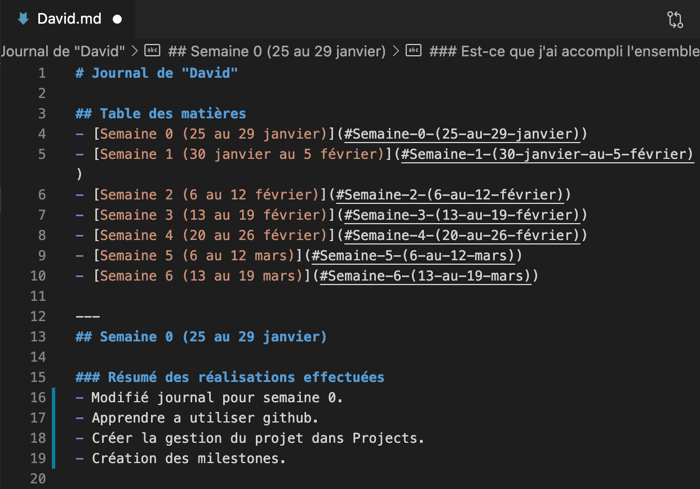
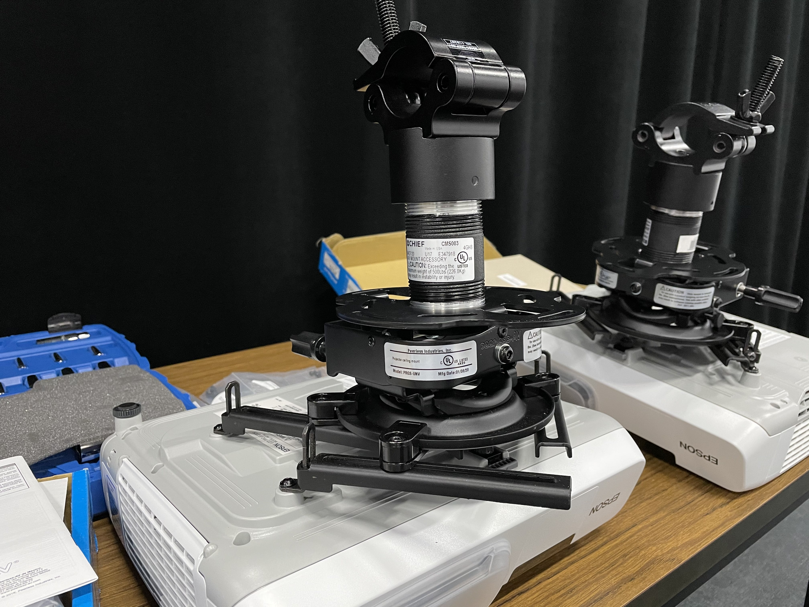
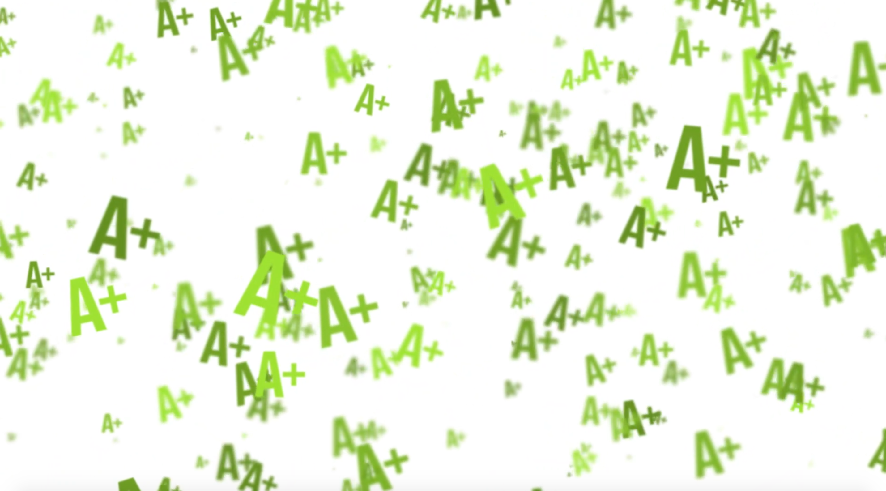

# Journal de "David"

## Table des matières
- [Semaine 0 (25 au 29 janvier)](#Semaine-0-(25-au-29-janvier))
- [Semaine 1 (30 janvier au 5 février)](#Semaine-1-(30-janvier-au-5-février))
- [Semaine 2 (6 au 12 février)](#Semaine-2-(6-au-12-février))
- [Semaine 3 (13 au 19 février)](#Semaine-3-(13-au-19-février))
- [Semaine 4 (20 au 26 février)](#Semaine-4-(20-au-26-février))
- [Semaine 5 (6 au 12 mars)](#Semaine-5-(6-au-12-mars))
- [Semaine 6 (13 au 19 mars)](#Semaine-6-(13-au-19-mars))

---
## Semaine 0 (25 au 29 janvier)

### Résumé des réalisations effectuées
- Modifié journal pour semaine 0.
- Apprendre a utiliser github.
- Créer la gestion du projet dans Projects.
- Création des milestones.

### Image d'une réalisation dont tu es la ou le plus fier

### Est-ce que j'ai accompli l'ensemble des tâches et objectifs que je m'étais fixés pour cette semaine?	
- [ ] Complètement
- [ ] Assez
- [x] Peu
- [ ] Pas du tout

#### Décrivez pourquoi.
Phasellus placerat malesuada dictum. Sed dapibus sem vulputate, blandit ligula non, hendrerit dolor. Vivamus congue sit amet nulla nec tristique. Fusce eget nisi justo. 

#### S'il y a lieu, qu'allez-vous faire pour remédier à la situation?
Nunc cursus dapibus congue. Nunc tristique commodo neque, vel iaculis turpis congue quis. Integer nec lobortis nisl, sit amet lacinia justo. Sed porta magna at nunc semper, quis vestibulum elit fermentum.

### Mon projet s'est-il réalisé selon l’échéancier prévu?

- [ ] Complètement
- [x] Assez
- [ ] Un peu
- [ ] Pas tout à fait

#### S'il y a des écarts, décrivez-les.
Mauris nec ante egestas, vulputate dolor a, suscipit nulla. Phasellus vitae nisl pharetra, dapibus purus quis, porttitor velit. Vestibulum nec mauris est.

#### S'il y a lieu, qu'allez-vous faire pour remédier à la situation?
Vestibulum ante ipsum primis in faucibus orci luctus et ultrices posuere cubilia curae; Donec porttitor at metus id viverra.

### Défis pour la prochaine semaine
Cras imperdiet felis nec suscipit gravida. Donec molestie ullamcorper metus, id viverra odio efficitur sit amet. Nullam sed elit orci. Maecenas fringilla libero nec augue vehicula blandit. Vestibulum laoreet finibus sagittis. Maecenas volutpat dui id mi tincidunt rhoncus. Phasellus placerat malesuada dictum.

---
## Semaine 1 (30 janvier au 5 février)
### Résumé des réalisations effectuées

- Modifié le moodboard pour qui soit plus clair.
- Effectuer l'inventaire de nôtre contenu multimédia sur excel.
- Réflechir au animations qu'on ajoutera pour notre espace interactif.
- Trouvé des inspiration de son pour nôtre jeu.

### Image d'une réalisation dont tu es la ou le plus fier

### Est-ce que j'ai accompli l'ensemble des tâches et objectifs que je m'étais fixés pour cette semaine?

- [ ] Complètement
- [x] Assez
- [ ] Peu
- [ ] Pas du tout

#### Décrivez pourquoi.
 
De mon côter, j'ai faite les modifications dans la préproductions apporté par le prof. On a dû modifier un peu nôtre concept par rapport à la réalisation qu'on va devoir faire pour sur place. 

#### S'il y a lieu, qu'allez-vous faire pour remédier à la situation?

Pour l'instant, on est correcte. On a faite les modifications requises.

### Mon projet s'est-il réalisé selon l’échéancier prévu?

- [ ] Complètement
- [x] Assez
- [ ] Un peu
- [ ] Pas tout à fait

#### S'il y a des écarts, décrivez-les.

On a eu des suggestions apporté par le prof, entre autre: Au lieu que le tout soit jouer sur un écran d'ordi, on pourrait le projeter vers l'avant pour une expérience plus immersif.

#### S'il y a lieu, qu'allez-vous faire pour remédier à la situation?

Pour le moment, on a pas de modification a faire.

### Défis pour la prochaine semaine

- Terminé la préprod pour la remise.
- Trouvé les sons pour nôtre jeu.
- Commencé les animations pour les projeter aux murs.

---
## Semaine 2 (6 au 12 février)
### Résumé des réalisations effectuées

- Terminer ce qui rester de la préprod.
- Recherches sur les animations.
- Commencement de l'installation de notre espace intéractif.
- Être présent au comité de diffusion.

### Image d'une réalisation dont tu es la ou le plus fier

### Est-ce que j'ai accompli l'ensemble des tâches et objectifs que je m'étais fixés pour cette semaine?

- [ ] Complètement
- [x] Assez
- [ ] Peu
- [ ] Pas du tout

#### Décrivez pourquoi.
 
On a pu finir la préprod à temps. J'aurais aimé commencer les animations mais j'était encore pas sur de l'approche que je voulais avoir avec le style de l'animation et de quoi on voulait qui ressemble. 

#### S'il y a lieu, qu'allez-vous faire pour remédier à la situation?

Pour l'instant ça va. C'est une question d'y consacrer plus de temps.

### Mon projet s'est-il réalisé selon l’échéancier prévu?

- [ ] Complètement
- [x] Assez
- [ ] Un peu
- [ ] Pas tout à fait

#### S'il y a des écarts, décrivez-les.

Oui. On a pu se rassembler avec l'équipe pour avoir une connaissance du milieu qu'on va utiliser ainsi que les matériels requis.

#### S'il y a lieu, qu'allez-vous faire pour remédier à la situation?

-

### Défis pour la prochaine semaine

- Faire un calendrier pour fixer les dates pour chaque animation.
- Commencer les animations.
- Installer les projecteurs.

---
## Semaine 3 (13 au 19 février)
### Résumé des réalisations effectuées

- Projecteurs installés.
- Se refamiliairiser avec Adobe After-Effect.
- Faire animation de A+ et F.

### Image d'une réalisation dont tu es la ou le plus fier

### Est-ce que j'ai accompli l'ensemble des tâches et objectifs que je m'étais fixés pour cette semaine?

- [ ] Complètement
- [X] Assez
- [ ] Peu
- [ ] Pas du tout

#### Décrivez pourquoi.
 
 J'ai réussi à faire deux des animations à l'aide du logiciel after effects.

#### S'il y a lieu, qu'allez-vous faire pour remédier à la situation?

Continuer à travailler.

### Mon projet s'est-il réalisé selon l’échéancier prévu?

- [ ] Complètement
- [X] Assez
- [ ] Un peu
- [ ] Pas tout à fait

#### S'il y a des écarts, décrivez-les.

Pour l'instant, on a pu faire de quoi avec ce qu'on avait de disponible, le reste on a besoin des matériels pour continuer le tout.

#### S'il y a lieu, qu'allez-vous faire pour remédier à la situation?

Continuer à travailler.

### Défis pour la prochaine semaine

- Continuer mes animations.
- Faire le thumbnail pour notre équipe.

---
## Semaine 4 (20 au 26 février)
### Résumé des réalisations effectuées

### Image d'une réalisation dont tu es la ou le plus fier

### Est-ce que j'ai accompli l'ensemble des tâches et objectifs que je m'étais fixés pour cette semaine?

- [ ] Complètement
- [ ] Assez
- [ ] Peu
- [ ] Pas du tout

#### Décrivez pourquoi.
 

#### S'il y a lieu, qu'allez-vous faire pour remédier à la situation?

### Mon projet s'est-il réalisé selon l’échéancier prévu?

- [ ] Complètement
- [ ] Assez
- [ ] Un peu
- [ ] Pas tout à fait

#### S'il y a des écarts, décrivez-les.

#### S'il y a lieu, qu'allez-vous faire pour remédier à la situation?

### Défis pour la prochaine semaine

---
## Semaine de rattrapage (27 février au 5 mars)
### Résumé des réalisations effectuées

### Image d'une réalisation dont tu es la ou le plus fier

### Est-ce que j'ai accompli l'ensemble des tâches et objectifs que je m'étais fixés pour cette semaine?

- [ ] Complètement
- [ ] Assez
- [ ] Peu
- [ ] Pas du tout

#### Décrivez pourquoi.
 

#### S'il y a lieu, qu'allez-vous faire pour remédier à la situation?

### Mon projet s'est-il réalisé selon l’échéancier prévu?

- [ ] Complètement
- [ ] Assez
- [ ] Un peu
- [ ] Pas tout à fait

#### S'il y a des écarts, décrivez-les.

#### S'il y a lieu, qu'allez-vous faire pour remédier à la situation?

### Défis pour la prochaine semaine

---
## Semaine 5 (6 au 12 mars)
### Résumé des réalisations effectuées

### Image d'une réalisation dont tu es la ou le plus fier

### Est-ce que j'ai accompli l'ensemble des tâches et objectifs que je m'étais fixés pour cette semaine?

- [ ] Complètement
- [ ] Assez
- [ ] Peu
- [ ] Pas du tout

#### Décrivez pourquoi.
 

#### S'il y a lieu, qu'allez-vous faire pour remédier à la situation?

### Mon projet s'est-il réalisé selon l’échéancier prévu?

- [ ] Complètement
- [ ] Assez
- [ ] Un peu
- [ ] Pas tout à fait

#### S'il y a des écarts, décrivez-les.

#### S'il y a lieu, qu'allez-vous faire pour remédier à la situation?

### Défis pour la prochaine semaine

---
## Semaine 6 (13 au 19 mars)
### Résumé des réalisations effectuées

### Image d'une réalisation dont tu es la ou le plus fier

### Est-ce que j'ai accompli l'ensemble des tâches et objectifs que je m'étais fixés pour cette semaine?

- [ ] Complètement
- [ ] Assez
- [ ] Peu
- [ ] Pas du tout

#### Décrivez pourquoi.
 

#### S'il y a lieu, qu'allez-vous faire pour remédier à la situation?

### Mon projet s'est-il réalisé selon l’échéancier prévu?

- [ ] Complètement
- [ ] Assez
- [ ] Un peu
- [ ] Pas tout à fait

#### S'il y a des écarts, décrivez-les.

#### S'il y a lieu, qu'allez-vous faire pour remédier à la situation?

### Défis pour la prochaine semaine
