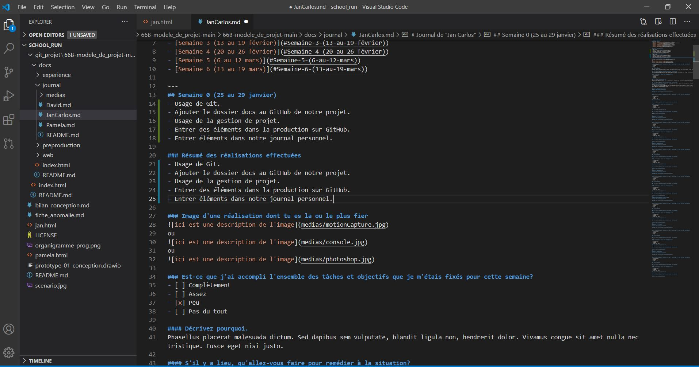
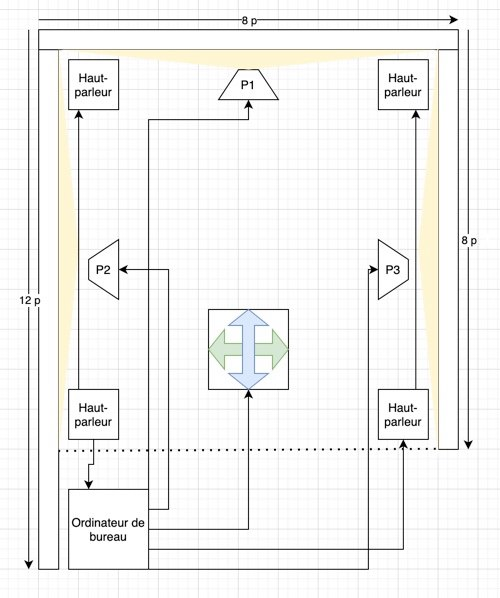
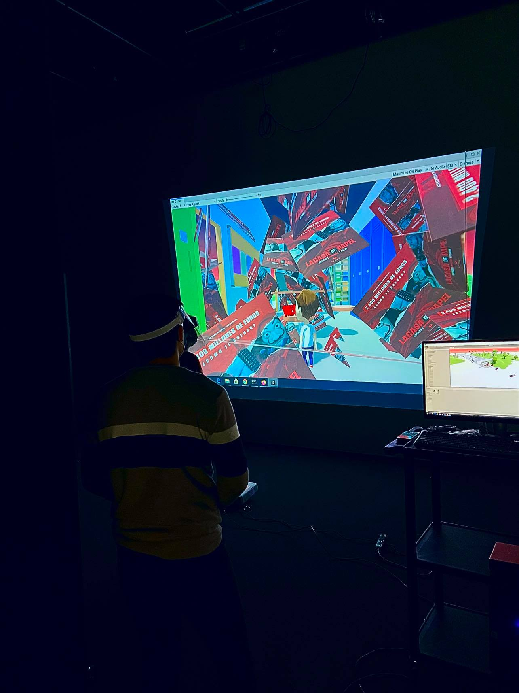

# Journal de "Jan Carlos"

## Table des matières
- [Semaine 0 (25 au 29 janvier)](#Semaine-0-(25-au-29-janvier))
- [Semaine 1 (30 janvier au 5 février)](#Semaine-1-(30-janvier-au-5-février))
- [Semaine 2 (6 au 12 février)](#Semaine-2-(6-au-12-février))
- [Semaine 3 (13 au 19 février)](#Semaine-3-(13-au-19-février))
- [Semaine 4 (20 au 26 février)](#Semaine-4-(20-au-26-février))
- [Semaine 5 (6 au 12 mars)](#Semaine-5-(6-au-12-mars))
- [Semaine 6 (13 au 19 mars)](#Semaine-6-(13-au-19-mars))

---
## Semaine 0 (25 au 29 janvier)

### Résumé des réalisations effectuées
- Usage de Git.
- Ajouter le dossier docs au GitHub de notre projet.
- Usage de la gestion de projet.
- Entrer des éléments dans la production sur GitHub.
- Entrer éléments dans notre journal personnel. 

### Image d'une réalisation dont tu es la ou le plus fier

### Est-ce que j'ai accompli l'ensemble des tâches et objectifs que je m'étais fixés pour cette semaine?	
- [ ] Complètement
- [ ] Assez
- [x] Peu
- [ ] Pas du tout

#### Décrivez pourquoi.
Parceque il y a des chose que je comprends bien sur GitHub et d'autres pas completement.

#### S'il y a lieu, qu'allez-vous faire pour remédier à la situation?
Connaitre plus GitHub.

### Mon projet s'est-il réalisé selon l’échéancier prévu?

- [ ] Complètement
- [x] Assez
- [ ] Un peu
- [ ] Pas tout à fait

#### S'il y a des écarts, décrivez-les.
Pour le moment, les tâches qu'on se donne nous l'aise comprendre que notre projet est réalisé selon l'échéance prévu.

#### S'il y a lieu, qu'allez-vous faire pour remédier à la situation?
Rencontre avec l'équipe et nous mettre à jours pour trouver des solution pour remédier la situation.

### Défis pour la prochaine semaine
- Terminer les panification technique (devis technique) Schémas ou plans techniques.
- Respecter l'échéancier.

---
## Semaine 1 (30 janvier au 5 février)
### Résumé des réalisations effectuées
- Présentation de notre preaprobation. 
- Rencontre avec l'Équipe pour voir les changement à effectuer.
- commencement d'un nouveaux schema de plantation par rapport au sugestion reçu.
- prendre rendez-vous avec Cedrick pour me guider dans tout ce qui est câblage et tout.
- premier meeting avec le commité technique.

### Image d'une réalisation dont tu es la ou le plus fier

### Est-ce que j'ai accompli l'ensemble des tâches et objectifs que je m'étais fixés pour cette semaine?

- [x] Complètement
- [ ] Assez
- [ ] Peu
- [ ] Pas du tout

#### Décrivez pourquoi.
 Parceque je reussi à faire tout ce qui été à faire pour cette semaine, bien sur qu'on à des modification à faire, alors le tout n'est pas fini, mais pour mes objectif de la semaine je pense avoir reussi.

#### S'il y a lieu, qu'allez-vous faire pour remédier à la situation?
On se rencontré en équipe et pour ma part comme je le deja mentioné je pris rendez-vous avec Cedrick pour avoir plus d'information sur tout ce qui est câblage et montage pour notre projet.

### Mon projet s'est-il réalisé selon l’échéancier prévu?

- [ ] Complètement
- [x] Assez
- [ ] Un peu
- [ ] Pas tout à fait

#### S'il y a des écarts, décrivez-les.
Pour le momment on travaillesur les modification et on vera par la suite.

#### S'il y a lieu, qu'allez-vous faire pour remédier à la situation?
Travailler plus et encore plus.

### Défis pour la prochaine semaine
Pour la semaine prochaine on aimerais avoir tout fini les modification et être prêt pour commencer a monter notre prototype.

---
## Semaine 2 (6 au 12 février)
### Résumé des réalisations effectuées
- Présentation de notre preaprobation final. 
- Rencontre avec l'Équipe pour voir les changement à effectuer pour l'ameliorer.
- adaptation de le schema de plantation par rapport au sugestion reçu.
- rencontre avec Cedrick  au grand studio pour nous familiariser avec l'équipement, le grand studio et la sale de matrixe.
- debut des essais technique sur place avec l'équipements.
- Deuxieme meeting avec le commité technique.
- Modification de la liste d'emprunt apres le meeting avec le comité technique.
- commencement de la modification du schema de branchement.
- Meeting avec l'équipe par rapport à ce qui a été parlé au comité technique, pour leurs faire part des modification a faires.

### Image d'une réalisation dont tu es la ou le plus fier

### Est-ce que j'ai accompli l'ensemble des tâches et objectifs que je m'étais fixés pour cette semaine?

- [x] Complètement
- [ ] Assez
- [ ] Peu
- [ ] Pas du tout

#### Décrivez pourquoi.
Parceque on a reussi à remettre L'apreprode à temps et que nous savon ou nous nous alignos.
 

#### S'il y a lieu, qu'allez-vous faire pour remédier à la situation?
Pour le momment c'est sur qu'il y a des questions par rapport a notre project, mais grace au meeting du comitée technique c'est plus claire.

### Mon projet s'est-il réalisé selon l’échéancier prévu?

- [ ] Complètement
- [x] Assez
- [ ] Un peu
- [ ] Pas tout à fait

#### S'il y a des écarts, décrivez-les.

#### S'il y a lieu, qu'allez-vous faire pour remédier à la situation?

### Défis pour la prochaine semaine
Mon défis pour la semaine prochaine serais commencer à faire des prototypes avec les sons et les projections. 
---
## Semaine 3 (13 au 19 février)
### Résumé des réalisations effectuées

### Image d'une réalisation dont tu es la ou le plus fier

### Est-ce que j'ai accompli l'ensemble des tâches et objectifs que je m'étais fixés pour cette semaine?

- [ ] Complètement
- [ ] Assez
- [ ] Peu
- [ ] Pas du tout

#### Décrivez pourquoi.
 

#### S'il y a lieu, qu'allez-vous faire pour remédier à la situation?

### Mon projet s'est-il réalisé selon l’échéancier prévu?

- [ ] Complètement
- [ ] Assez
- [ ] Un peu
- [ ] Pas tout à fait

#### S'il y a des écarts, décrivez-les.

#### S'il y a lieu, qu'allez-vous faire pour remédier à la situation?

### Défis pour la prochaine semaine

---
## Semaine 4 (20 au 26 février)
### Résumé des réalisations effectuées

### Image d'une réalisation dont tu es la ou le plus fier

### Est-ce que j'ai accompli l'ensemble des tâches et objectifs que je m'étais fixés pour cette semaine?

- [ ] Complètement
- [ ] Assez
- [ ] Peu
- [ ] Pas du tout

#### Décrivez pourquoi.
 

#### S'il y a lieu, qu'allez-vous faire pour remédier à la situation?

### Mon projet s'est-il réalisé selon l’échéancier prévu?

- [ ] Complètement
- [ ] Assez
- [ ] Un peu
- [ ] Pas tout à fait

#### S'il y a des écarts, décrivez-les.

#### S'il y a lieu, qu'allez-vous faire pour remédier à la situation?

### Défis pour la prochaine semaine

---
## Semaine de rattrapage (27 février au 5 mars)
### Résumé des réalisations effectuées

### Image d'une réalisation dont tu es la ou le plus fier

### Est-ce que j'ai accompli l'ensemble des tâches et objectifs que je m'étais fixés pour cette semaine?

- [ ] Complètement
- [ ] Assez
- [ ] Peu
- [ ] Pas du tout

#### Décrivez pourquoi.
 

#### S'il y a lieu, qu'allez-vous faire pour remédier à la situation?

### Mon projet s'est-il réalisé selon l’échéancier prévu?

- [ ] Complètement
- [ ] Assez
- [ ] Un peu
- [ ] Pas tout à fait

#### S'il y a des écarts, décrivez-les.

#### S'il y a lieu, qu'allez-vous faire pour remédier à la situation?

### Défis pour la prochaine semaine

---
## Semaine 5 (6 au 12 mars)
### Résumé des réalisations effectuées

### Image d'une réalisation dont tu es la ou le plus fier

### Est-ce que j'ai accompli l'ensemble des tâches et objectifs que je m'étais fixés pour cette semaine?

- [ ] Complètement
- [ ] Assez
- [ ] Peu
- [ ] Pas du tout

#### Décrivez pourquoi.
 

#### S'il y a lieu, qu'allez-vous faire pour remédier à la situation?

### Mon projet s'est-il réalisé selon l’échéancier prévu?

- [ ] Complètement
- [ ] Assez
- [ ] Un peu
- [ ] Pas tout à fait

#### S'il y a des écarts, décrivez-les.

#### S'il y a lieu, qu'allez-vous faire pour remédier à la situation?

### Défis pour la prochaine semaine

---
## Semaine 6 (13 au 19 mars)
### Résumé des réalisations effectuées

### Image d'une réalisation dont tu es la ou le plus fier

### Est-ce que j'ai accompli l'ensemble des tâches et objectifs que je m'étais fixés pour cette semaine?

- [ ] Complètement
- [ ] Assez
- [ ] Peu
- [ ] Pas du tout

#### Décrivez pourquoi.
 

#### S'il y a lieu, qu'allez-vous faire pour remédier à la situation?

### Mon projet s'est-il réalisé selon l’échéancier prévu?

- [ ] Complètement
- [ ] Assez
- [ ] Un peu
- [ ] Pas tout à fait

#### S'il y a des écarts, décrivez-les.

#### S'il y a lieu, qu'allez-vous faire pour remédier à la situation?

### Défis pour la prochaine semaine
