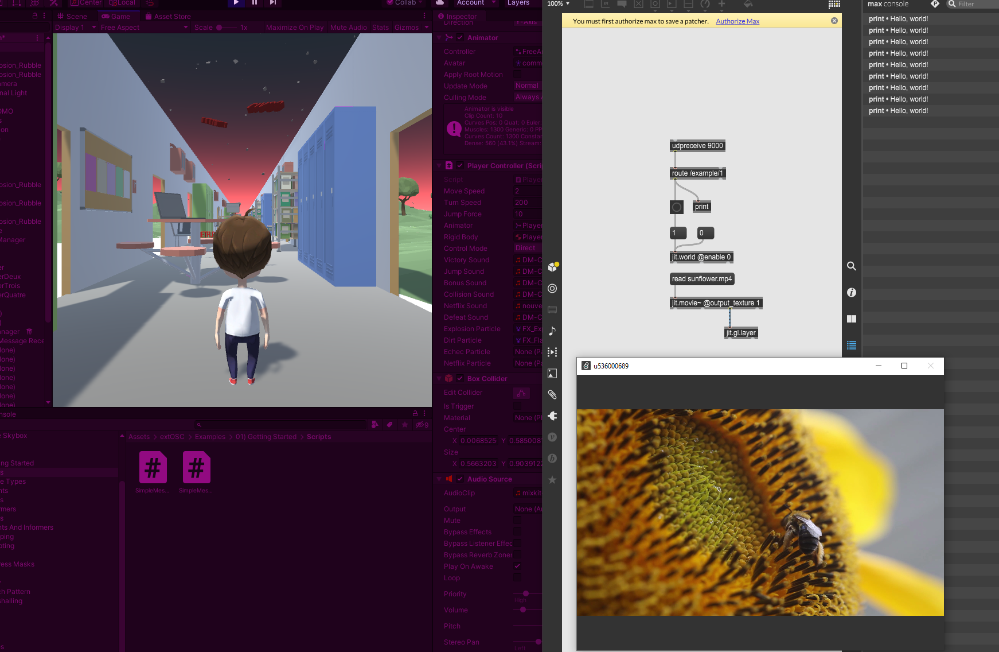
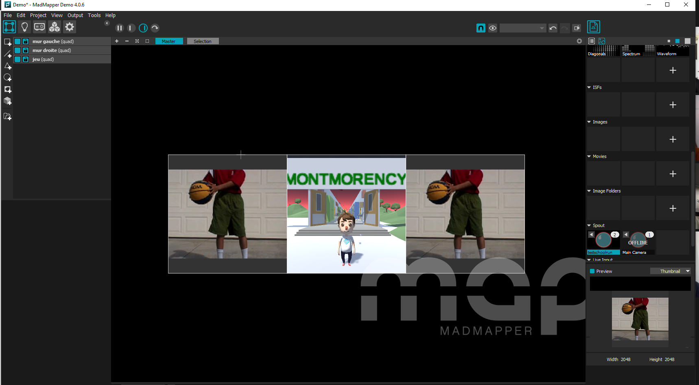

# Journal de "Pamela"

## Table des matières
- [Semaine 0 (25 au 29 janvier)](#Semaine-0-(25-au-29-janvier))
- [Semaine 1 (30 janvier au 5 février)](#Semaine-1-(30-janvier-au-5-février))
- [Semaine 2 (6 au 12 février)](#Semaine-2-(6-au-12-février))
- [Semaine 3 (13 au 19 février)](#Semaine-3-(13-au-19-février))
- [Semaine 4 (20 au 26 février)](#Semaine-4-(20-au-26-février))
- [Semaine 5 (6 au 12 mars)](#Semaine-5-(6-au-12-mars))
- [Semaine 6 (13 au 19 mars)](#Semaine-6-(13-au-19-mars))

---
## Semaine 0 (25 au 29 janvier)

### Résumé des réalisations effectuées
- Retour sur l'usage de Git et explications à Jan Carlos et David de la marche à suivre.
- Créer les issues
- Assigner les tâches dans le Kanban
- Mettre à jour le journal pour la semaine 0
- Faire la liste des tâches des membres de l'équipe
- Déterminer les rôles des membres de l'équipe
- Déterminer les moments de rencontres d'équipe
- Organiser l'échéancier global

### Image d'une réalisation dont tu es la ou le plus fier

Pourquoi ? Parce que j'ai compris comment utiliser le terminal.

### Est-ce que j'ai accompli l'ensemble des tâches et objectifs que je m'étais fixés pour cette semaine?	
- [x] Complètement
- [ ] Assez
- [ ] Peu
- [ ] Pas du tout

#### Décrivez pourquoi.
Je me suis fait un horaire très détaillé du mardi 26 janvier jusqu'au vendredi 29 janvier. À chaque jour, j'avais des tâches précises à faire et je me suis arrangée pour les faire, peu importe ce qui arrivait.

#### S'il y a lieu, qu'allez-vous faire pour remédier à la situation?
Pour cette semaine, cette section ne s'applique pas.

### Mon projet s'est-il réalisé selon l’échéancier prévu?

- [x] Complètement
- [ ] Assez
- [ ] Un peu
- [ ] Pas tout à fait

#### S'il y a des écarts, décrivez-les.
J'ai bien respecté l'échéancier que j'avais établi le 26 janvier.

#### S'il y a lieu, qu'allez-vous faire pour remédier à la situation?
Pour cette semaine, cette section ne s'applique pas.

### Défis pour la prochaine semaine
- Déterminer comment faire le lien entre la partie virtuelle et la partie réelle de notre expérience.
- S'assurer qu'il y ai une bonne cohésion entre toutes les parties de la préproduction.
- Vérifier que l'entièreté des éléments nécessaires sont présent et assez bien expliqués pour qu'en cas de problème, on trouve facilement nos solutions.
- S'assurer que chaque membre de l'équipe respecte l'échéancier.

---
## Semaine 1 (30 janvier au 5 février)
### Résumé des réalisations effectuées
- Créer et assigner les issues pour les corrections de la préproduction
- Effectuer les corrections pour les issues sur GitHub
- Recherches pour matériel scénographique
- Modifications de comment l'expérience va se vivre
- Faire le suivi de l'avancement des membres de l'équipe
- Création du tableau pour les revenus et les dépenses
- Recherches pour l'univers artistiques des éléments [En cours]

### Image d'une réalisation dont tu es la ou le plus fier

Pourquoi ? Parce que grâce à Guillaume, j'ai appris l'existence des labels et que c'est beaucoup plus clair comme ça.

### Est-ce que j'ai accompli l'ensemble des tâches et objectifs que je m'étais fixés pour cette semaine?

- [ ] Complètement
- [x] Assez
- [ ] Peu
- [ ] Pas du tout

#### Décrivez pourquoi.
 Pour le côté de la préproduction, ça avance bien. Nous sommes en train de faire les corrections suggérées par les profs. Je m'assure également que ce qui est mit dans la préproduction convient à chaque membre de l'équipe. Par contre, c'est les recherches pour lier le réel et le jeu qui n'ont pas eu lieu. Je n'ai pas prit le temps de le faire.

#### S'il y a lieu, qu'allez-vous faire pour remédier à la situation?
Normalement, ce genre de problème ne devrait plus se produire, car maintenant nous savons plus précisement comment notre expérience va se dérouler.

### Mon projet s'est-il réalisé selon l’échéancier prévu?

- [ ] Complètement
- [x] Assez
- [ ] Un peu
- [ ] Pas tout à fait

#### S'il y a des écarts, décrivez-les.
Nous avons changé un détail : au lieu de se contrôler par clavier et souris, le jeu se contrôlera par un tapis DDR (si nous trouvons de la documentation pour bien intégrer cette partie, sinon, nous nous tournerons vers la manette de jeu).

#### S'il y a lieu, qu'allez-vous faire pour remédier à la situation?
Nous n'avons plus d'éléments qui requièrent des changements drastiques, donc en ne perdant pas de vue notre objectif, il ne devrait pas y avoir de problème. Ça va demander beaucoup de recherches et de tests.

### Défis pour la prochaine semaine
- Trouver comment intégrer un tapis de DDR
- Terminer l'univers artistique des éléments
- Terminer Inventaire du contenu multimédia
- Mettre à jour les ressources humaines requises
- Faire une dernière vérification de la préproduction avec l'équipe avant la remise.

---
## Semaine 2 (6 au 12 février)
### Résumé des réalisations effectuées
- Finalisation des différentes parties de la préproduction non complétées 
- Recherches sur les inspirations visuelles pour les vidéos
- Avoir suivi la formation pour le grand studio et la salle des matrices
- Début de l'installation de l'équipement dans le grand studio
- Acquisition du matériel de scénographie

### Image d'une réalisation dont tu es la ou le plus fier

Pourquoi ? Parce qu'après 30 minutes, on a réussi à faire projeter l'écran.

### Est-ce que j'ai accompli l'ensemble des tâches et objectifs que je m'étais fixés pour cette semaine?

- [ ] Complètement
- [x] Assez
- [ ] Peu
- [ ] Pas du tout

#### Décrivez pourquoi.
 La préproduction a été complétée à temps et correctement. Nous avons un peu meilleure idée de comment joindre le tapis avec le jeu, mais ça reste encore pas mal vague, car nous n'avons pas encore eu l'occasion de faire des tests.

#### S'il y a lieu, qu'allez-vous faire pour remédier à la situation?
Arrêter de procrastiner. Il faut commencer à comprendre comment faire en sorte que les logiciels communiquent entre eux.

### Mon projet s'est-il réalisé selon l’échéancier prévu?

- [x] Complètement
- [ ] Assez
- [ ] Un peu
- [ ] Pas tout à fait

#### S'il y a des écarts, décrivez-les.
Pour cette semaine, je voulais aller au studio pour avoir une meilleure idée de comment on allait s'organiser et de commencer à installer l'équipement, ce que nous avons fait.

#### S'il y a lieu, qu'allez-vous faire pour remédier à la situation?
Ne s'applique pas pour cette semaine.

### Défis pour la prochaine semaine
- Installer les projecteurs.
- Trouver la meilleure façon de camoufler la ligne sur le mur.
- Ajuster les projecteurs une fois que les murs vont être montés.
- Installer les haut-parleurs.
- Si on recoit le tapis DDR cette semaine, couper le tapis fitness et installer.
- Créer un code simple (du genre si on touche quelque chose dans unity, une vidéo commence dans Max)
---
## Semaine 3 (13 au 19 février)
### Résumé des réalisations effectuées
- Rencontre avec Thomas pour s'informer sur OSC.
- Faire des essais pour lier Unity et Max.
- Une fois que les essais ont été concluants, j'ai lié notre jeu avec Max.

### Image d'une réalisation dont tu es la ou le plus fier

Pourquoi ? Parce que j'ai réussi à lier Unity et Max, tandis que c'était LE morceau qui me faisait le plus peur.

### Est-ce que j'ai accompli l'ensemble des tâches et objectifs que je m'étais fixés pour cette semaine?

- [ ] Complètement
- [ ] Assez
- [x] Peu
- [ ] Pas du tout

#### Décrivez pourquoi.
 Principalement, pour cette semaine, je voulais terminer d'installer l'équipement. Jan a installé les projecteurs, mais nous n'avons pas pu les ajuster car les murs ne sont pas montés. Aussi, nous n'avons pas encore les haut-parleurs ni le tapis DDR, donc question installation, ça n'a pas beaucoup avancé. Par contre, je suis vraiment contente d'avoir réussi à lier le jeu avec Max. Juste faire des essais c'était quelque chose, mais trouver une façon d'adapter le code au personnage en était une autre.

#### S'il y a lieu, qu'allez-vous faire pour remédier à la situation?
C'est malheureusement hors de mon contrôle. Aussitôt que nous recevons le reste de l'équipement, nous pourrons l'installer.

### Mon projet s'est-il réalisé selon l’échéancier prévu?

- [ ] Complètement
- [x] Assez
- [ ] Un peu
- [ ] Pas tout à fait

#### S'il y a des écarts, décrivez-les.
J'aurais aimé être plus avancée pour l'installation de l'équipement et pour lier le son et Max. Je sais déjà comment je vais faire la base, il ne reste qu'à adapter avec les haut-parleurs.

#### S'il y a lieu, qu'allez-vous faire pour remédier à la situation?
Continuer de travailler le plus possible.

### Défis pour la prochaine semaine
- Mettre les évènements de projection sur chaque obstacle et bonus.
- Déterminer quels sont vont être joués à partir d'Unity et quels seront joués à partir de Max.
- Mettre les évènements de sons sur les éléments appropriés.
- Faire des essais avec Spout pour lier Max et Madmapper.

---
## Semaine 4 (20 au 26 février)
### Résumé des réalisations effectuées
- Mettre les évènements de projection sur chaque obstacle et bonus
- Déterminer quels sont vont être joués en ambiance (Unity) et ceux joués en effets sonores (Max)
- Mettre les effets de sons sur obstacles
- Utilisation de Spout pour lier Max et Madmapper
- Création d'un échéancier plus stricte pour les animations

### Image d'une réalisation dont tu es la ou le plus fier

Pourquoi ? Parce que j'ai réussi à lier Unity, Max ET Madmapper !

### Est-ce que j'ai accompli l'ensemble des tâches et objectifs que je m'étais fixés pour cette semaine?

- [x] Complètement
- [ ] Assez
- [ ] Peu
- [ ] Pas du tout

#### Décrivez pourquoi.
 J'ai réussi encore plus facilement que je croyais à lier Max et Madmapper, donc le reste de travail, pour ma part, risque d'aller bien.

#### S'il y a lieu, qu'allez-vous faire pour remédier à la situation?
Pas applicable cette semaine.

### Mon projet s'est-il réalisé selon l’échéancier prévu?

- [ ] Complètement
- [x] Assez
- [ ] Un peu
- [ ] Pas tout à fait

#### S'il y a des écarts, décrivez-les.
Pour ce qui est du code et de l'installation en tant que tel, nous avançons très bien. Par contre, pour les animations, ça prend un peu de retard.

#### S'il y a lieu, qu'allez-vous faire pour remédier à la situation?
Nous avons fait un échéancier plus stricte pour la production des animations.

### Défis pour la prochaine semaine
- Se tenir à jour de l'avancement des membres de l'équipe et mieux encadrer tâches de chacun.
- Installer et brancher les deux projecteurs restants pour pouvoir finir de configurer Madmapper.
- Créer le menu de début dans Unity.
- Commencer à créer les menus de fin dans Unity.
---
## Semaine de rattrapage (27 février au 5 mars)
### Résumé des réalisations effectuées
- Se terir à jour de l'avancement des membres de l'équipe.
- Commencer les menus de début et de fin.
- Ajouter l'obstacle Facebook.
- Ajouter des A+.
- Modifier le code pour que les nouveaux obstacles déclenchent des évènements dans max.

### Image d'une réalisation dont tu es la ou le plus fier

Pourquoi ? Parce que maintenant, les obstacles sont tous présents.

### Est-ce que j'ai accompli l'ensemble des tâches et objectifs que je m'étais fixés pour cette semaine?

- [ ] Complètement
- [x] Assez
- [ ] Peu
- [ ] Pas du tout

#### Décrivez pourquoi.
 J'avais de la difficulté à me concentrer sur les menus, alors je me suis tournée vers les obstacles ainsi que la relation de ceux-ci avec le personnage. Nous n'avons pas branché les projecteurs à l'ordinateur, car nous n'avions pas encore le matériel nécessaire.

#### S'il y a lieu, qu'allez-vous faire pour remédier à la situation?
Je n'ai pas fait ce que j'avais prévu, mais dans un sens j'ai quand même beaucoup avancé. Donc juste de respecter ce que je dis que je vais faire au lieu de commencer une autre tâche.

### Mon projet s'est-il réalisé selon l’échéancier prévu?

- [ ] Complètement
- [x] Assez
- [ ] Un peu
- [ ] Pas tout à fait

#### S'il y a des écarts, décrivez-les.
Un fois que l'équipement va avoir été installé, j'ai l'impression qu'on va avoir avancé d'un énorme pas, car nous allons pouvoir faire les tests en réel, directement sur les trois murs.

#### S'il y a lieu, qu'allez-vous faire pour remédier à la situation?
Redoubler d'ardeur.

### Défis pour la prochaine semaine
- Enregistrer les voix.
- Créer le système booléen.
- Assigner le bool aux obstacles et créer les conditions pour telle et telle fin.
- Faire la vidéo de Netflix.
- Faire la vidéo de Facebook.
- Faire la vidéo de COVID.
---
## Semaine 5 (6 au 12 mars)
### Résumé des réalisations effectuées
- Enregistrer les voix.
- Faire la vidéo de Netflix.
- Faire la vidéo de Facebook.
- Continuer l'installation de l'équipement.
- Intégrer les bons sons et bonnes vidéos dans max.

### Image d'une réalisation dont tu es la ou le plus fier

Pourquoi ? Parce que j'ai découvert qu'After Effects ne m'aime pas, mais j'ai gagné contre lui !

### Est-ce que j'ai accompli l'ensemble des tâches et objectifs que je m'étais fixés pour cette semaine?

- [ ] Complètement
- [ ] Assez
- [x] Peu
- [ ] Pas du tout

#### Décrivez pourquoi.
 Jan et moi avons convenu qu'il allait terminer tout ce qu'il avait à faire avec Unity pour ensuite m'envoyer le fichier. Comme ça, nous n'avons pas à gérer deux personnes qui codent en même temps. J'ai donc travaillé sur les vidéos et j'ai aidé pour bien calibrer les projections.

#### S'il y a lieu, qu'allez-vous faire pour remédier à la situation?
Pas tant applicable. Une fois que je vais avoir le fichier, je vais faire ma part.

### Mon projet s'est-il réalisé selon l’échéancier prévu?

- [ ] Complètement
- [x] Assez
- [ ] Un peu
- [ ] Pas tout à fait

#### S'il y a des écarts, décrivez-les.
Il y a deux parties qui sont plus en retard : les animations et les menus. Il reste encore trois animations à faire. Pour les menus, je sais comment les faire et ça ne devrait pas me prendre trop de temps.

#### S'il y a lieu, qu'allez-vous faire pour remédier à la situation?
Je vais continuer d'optimiser mon temps en avançant tout ce que je peux en attendant d'avoir le code final d'Unity de Jan.

### Défis pour la prochaine semaine
- Menu début.
- Menu fins.
- Faire apparaître les menus selon le score.
---
## Semaine 6 (13 au 19 mars)
### Résumé des réalisations effectuées

### Image d'une réalisation dont tu es la ou le plus fier

### Est-ce que j'ai accompli l'ensemble des tâches et objectifs que je m'étais fixés pour cette semaine?

- [ ] Complètement
- [ ] Assez
- [ ] Peu
- [ ] Pas du tout

#### Décrivez pourquoi.
 

#### S'il y a lieu, qu'allez-vous faire pour remédier à la situation?

### Mon projet s'est-il réalisé selon l’échéancier prévu?

- [ ] Complètement
- [ ] Assez
- [ ] Un peu
- [ ] Pas tout à fait

#### S'il y a des écarts, décrivez-les.

#### S'il y a lieu, qu'allez-vous faire pour remédier à la situation?

### Défis pour la prochaine semaine
