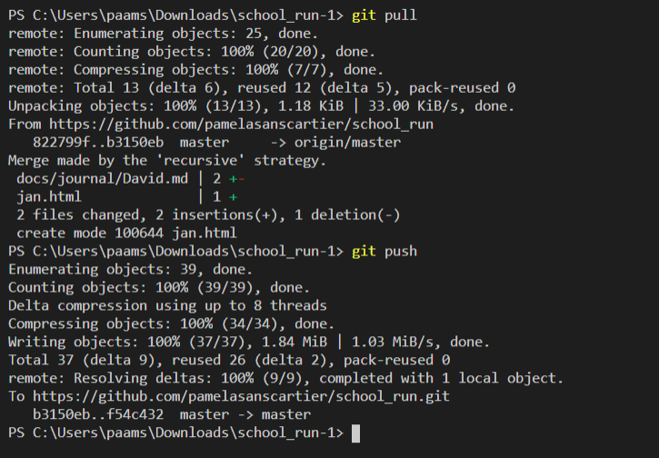
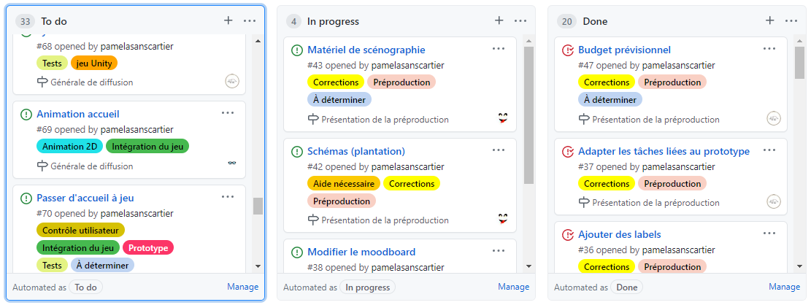
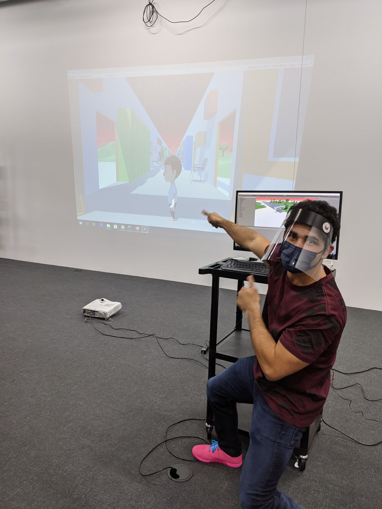

# Journal de "Pamela"

## Table des matières
- [Semaine 0 (25 au 29 janvier)](#Semaine-0-(25-au-29-janvier))
- [Semaine 1 (30 janvier au 5 février)](#Semaine-1-(30-janvier-au-5-février))
- [Semaine 2 (6 au 12 février)](#Semaine-2-(6-au-12-février))
- [Semaine 3 (13 au 19 février)](#Semaine-3-(13-au-19-février))
- [Semaine 4 (20 au 26 février)](#Semaine-4-(20-au-26-février))
- [Semaine 5 (6 au 12 mars)](#Semaine-5-(6-au-12-mars))
- [Semaine 6 (13 au 19 mars)](#Semaine-6-(13-au-19-mars))

---
## Semaine 0 (25 au 29 janvier)

### Résumé des réalisations effectuées
- Retour sur l'usage de Git et explications à Jan Carlos et David de la marche à suivre.
- Créer les issues
- Assigner les tâches dans le Kanban
- Mettre à jour le journal pour la semaine 0
- Faire la liste des tâches des membres de l'équipe
- Déterminer les rôles des membres de l'équipe
- Déterminer les moments de rencontres d'équipe
- Organiser l'échéancier global

### Image d'une réalisation dont tu es la ou le plus fier

Pourquoi ? Parce que j'ai compris comment utiliser le terminal.

### Est-ce que j'ai accompli l'ensemble des tâches et objectifs que je m'étais fixés pour cette semaine?	
- [x] Complètement
- [ ] Assez
- [ ] Peu
- [ ] Pas du tout

#### Décrivez pourquoi.
Je me suis fait un horaire très détaillé du mardi 26 janvier jusqu'au vendredi 29 janvier. À chaque jour, j'avais des tâches précises à faire et je me suis arrangée pour les faire, peu importe ce qui arrivait.

#### S'il y a lieu, qu'allez-vous faire pour remédier à la situation?
Pour cette semaine, cette section ne s'applique pas.

### Mon projet s'est-il réalisé selon l’échéancier prévu?

- [x] Complètement
- [ ] Assez
- [ ] Un peu
- [ ] Pas tout à fait

#### S'il y a des écarts, décrivez-les.
J'ai bien respecté l'échéancier que j'avais établi le 26 janvier.

#### S'il y a lieu, qu'allez-vous faire pour remédier à la situation?
Pour cette semaine, cette section ne s'applique pas.

### Défis pour la prochaine semaine
- Déterminer comment faire le lien entre la partie virtuelle et la partie réelle de notre expérience.
- S'assurer qu'il y ai une bonne cohésion entre toutes les parties de la préproduction.
- Vérifier que l'entièreté des éléments nécessaires sont présent et assez bien expliqués pour qu'en cas de problème, on trouve facilement nos solutions.
- S'assurer que chaque membre de l'équipe respecte l'échéancier.

---
## Semaine 1 (30 janvier au 5 février)
### Résumé des réalisations effectuées
- Créer et assigner les issues pour les corrections de la préproduction
- Effectuer les corrections pour les issues sur GitHub
- Recherches pour matériel scénographique
- Modifications de comment l'expérience va se vivre
- Faire le suivi de l'avancement des membres de l'équipe
- Création du tableau pour les revenus et les dépenses
- Recherches pour l'univers artistiques des éléments [En cours]

### Image d'une réalisation dont tu es la ou le plus fier

Pourquoi ? Parce que grâce à Guillaume, j'ai appris l'existence des labels et que c'est beaucoup plus clair comme ça.

### Est-ce que j'ai accompli l'ensemble des tâches et objectifs que je m'étais fixés pour cette semaine?

- [ ] Complètement
- [x] Assez
- [ ] Peu
- [ ] Pas du tout

#### Décrivez pourquoi.
 Pour le côté de la préproduction, ça avance bien. Nous sommes en train de faire les corrections suggérées par les profs. Je m'assure également que ce qui est mit dans la préproduction convient à chaque membre de l'équipe. Par contre, c'est les recherches pour lier le réel et le jeu qui n'ont pas eu lieu. Je n'ai pas prit le temps de le faire.

#### S'il y a lieu, qu'allez-vous faire pour remédier à la situation?
Normalement, ce genre de problème ne devrait plus se produire, car maintenant nous savons plus précisement comment notre expérience va se dérouler.

### Mon projet s'est-il réalisé selon l’échéancier prévu?

- [ ] Complètement
- [x] Assez
- [ ] Un peu
- [ ] Pas tout à fait

#### S'il y a des écarts, décrivez-les.
Nous avons changé un détail : au lieu de se contrôler par clavier et souris, le jeu se contrôlera par un tapis DDR (si nous trouvons de la documentation pour bien intégrer cette partie, sinon, nous nous tournerons vers la manette de jeu).

#### S'il y a lieu, qu'allez-vous faire pour remédier à la situation?
Nous n'avons plus d'éléments qui requièrent des changements drastiques, donc en ne perdant pas de vue notre objectif, il ne devrait pas y avoir de problème. Ça va demander beaucoup de recherches et de tests.

### Défis pour la prochaine semaine
- Trouver comment intégrer un tapis de DDR
- Terminer l'univers artistique des éléments
- Terminer Inventaire du contenu multimédia
- Mettre à jour les ressources humaines requises
- Faire une dernière vérification de la préproduction avec l'équipe avant la remise.

---
## Semaine 2 (6 au 12 février)
### Résumé des réalisations effectuées
- Finalisation des différentes parties de la préproduction non complétées (Univers artistique, inventaire, ressources humaines)
- Avoir suivi la formation pour le grand studio
- Début de l'installation de l'équipement dans le grand studio
- Acquisition du matériel de scénographie

### Image d'une réalisation dont tu es la ou le plus fier

### Est-ce que j'ai accompli l'ensemble des tâches et objectifs que je m'étais fixés pour cette semaine?

- [ ] Complètement
- [x] Assez
- [ ] Peu
- [ ] Pas du tout

#### Décrivez pourquoi.
 La préproduction a été complétée à temps et correctement. Nous avons un peu meilleure idée de comment joindre le tapis avec le jeu, mais ça reste encore pas mal vague, car nous n'avons pas encore eu l'occasion de faire des tests.

#### S'il y a lieu, qu'allez-vous faire pour remédier à la situation?
Arrêter de procrastiner. Il faut commencer à comprendre comment faire en sorte que les logiciels communiquent entre eux.

### Mon projet s'est-il réalisé selon l’échéancier prévu?

- [x] Complètement
- [ ] Assez
- [ ] Un peu
- [ ] Pas tout à fait

#### S'il y a des écarts, décrivez-les.
Pour cette semaine, je voulais aller au studio pour avoir une meilleure idée de comment on allait s'organiser et de commencer à installer l'équipement, ce que nous avons fait.

#### S'il y a lieu, qu'allez-vous faire pour remédier à la situation?

### Défis pour la prochaine semaine

---
## Semaine 3 (13 au 19 février)
### Résumé des réalisations effectuées

### Image d'une réalisation dont tu es la ou le plus fier

### Est-ce que j'ai accompli l'ensemble des tâches et objectifs que je m'étais fixés pour cette semaine?

- [ ] Complètement
- [ ] Assez
- [ ] Peu
- [ ] Pas du tout

#### Décrivez pourquoi.
 

#### S'il y a lieu, qu'allez-vous faire pour remédier à la situation?

### Mon projet s'est-il réalisé selon l’échéancier prévu?

- [ ] Complètement
- [ ] Assez
- [ ] Un peu
- [ ] Pas tout à fait

#### S'il y a des écarts, décrivez-les.

#### S'il y a lieu, qu'allez-vous faire pour remédier à la situation?

### Défis pour la prochaine semaine

---
## Semaine 4 (20 au 26 février)
### Résumé des réalisations effectuées

### Image d'une réalisation dont tu es la ou le plus fier

### Est-ce que j'ai accompli l'ensemble des tâches et objectifs que je m'étais fixés pour cette semaine?

- [ ] Complètement
- [ ] Assez
- [ ] Peu
- [ ] Pas du tout

#### Décrivez pourquoi.
 

#### S'il y a lieu, qu'allez-vous faire pour remédier à la situation?

### Mon projet s'est-il réalisé selon l’échéancier prévu?

- [ ] Complètement
- [ ] Assez
- [ ] Un peu
- [ ] Pas tout à fait

#### S'il y a des écarts, décrivez-les.

#### S'il y a lieu, qu'allez-vous faire pour remédier à la situation?

### Défis pour la prochaine semaine

---
## Semaine de rattrapage (27 février au 5 mars)
### Résumé des réalisations effectuées

### Image d'une réalisation dont tu es la ou le plus fier

### Est-ce que j'ai accompli l'ensemble des tâches et objectifs que je m'étais fixés pour cette semaine?

- [ ] Complètement
- [ ] Assez
- [ ] Peu
- [ ] Pas du tout

#### Décrivez pourquoi.
 

#### S'il y a lieu, qu'allez-vous faire pour remédier à la situation?

### Mon projet s'est-il réalisé selon l’échéancier prévu?

- [ ] Complètement
- [ ] Assez
- [ ] Un peu
- [ ] Pas tout à fait

#### S'il y a des écarts, décrivez-les.

#### S'il y a lieu, qu'allez-vous faire pour remédier à la situation?

### Défis pour la prochaine semaine

---
## Semaine 5 (6 au 12 mars)
### Résumé des réalisations effectuées

### Image d'une réalisation dont tu es la ou le plus fier

### Est-ce que j'ai accompli l'ensemble des tâches et objectifs que je m'étais fixés pour cette semaine?

- [ ] Complètement
- [ ] Assez
- [ ] Peu
- [ ] Pas du tout

#### Décrivez pourquoi.
 

#### S'il y a lieu, qu'allez-vous faire pour remédier à la situation?

### Mon projet s'est-il réalisé selon l’échéancier prévu?

- [ ] Complètement
- [ ] Assez
- [ ] Un peu
- [ ] Pas tout à fait

#### S'il y a des écarts, décrivez-les.

#### S'il y a lieu, qu'allez-vous faire pour remédier à la situation?

### Défis pour la prochaine semaine

---
## Semaine 6 (13 au 19 mars)
### Résumé des réalisations effectuées

### Image d'une réalisation dont tu es la ou le plus fier

### Est-ce que j'ai accompli l'ensemble des tâches et objectifs que je m'étais fixés pour cette semaine?

- [ ] Complètement
- [ ] Assez
- [ ] Peu
- [ ] Pas du tout

#### Décrivez pourquoi.
 

#### S'il y a lieu, qu'allez-vous faire pour remédier à la situation?

### Mon projet s'est-il réalisé selon l’échéancier prévu?

- [ ] Complètement
- [ ] Assez
- [ ] Un peu
- [ ] Pas tout à fait

#### S'il y a des écarts, décrivez-les.

#### S'il y a lieu, qu'allez-vous faire pour remédier à la situation?

### Défis pour la prochaine semaine
